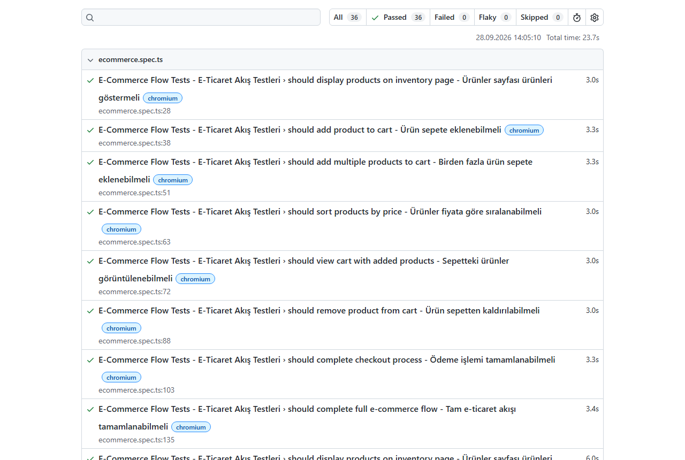

# SauceDemo Playwright E2E Tests

[](https://github.com/db-akyol/saucedemo-playwright-e2e/actions/workflows/playwright.yml)


End-to-end UI tests for the [SauceDemo](https://www.saucedemo.com) e-commerce demo site, written with **Playwright + TypeScript** and the **Page Object Model**.
Tests run on Chromium, Firefox and WebKit, and on every push with **GitHub Actions**.

> A BDD (Gherkin) version of this project: [playwright-bdd-e2e-framework](https://github.com/db-akyol/playwright-bdd-e2e-framework)



## Test scenarios

**Login** (`tests/login.spec.ts`)

- Login page is shown correctly (logo, page title)
- Login with valid user goes to the products page
- Locked-out user sees an error message
- Wrong username / password shows an error message

**E-commerce flow** (`tests/ecommerce.spec.ts`)

- Products page lists 6 products
- Add one product / multiple products to the cart
- Sort products by price (low to high)
- Cart page shows the added product
- Remove a product from the cart
- Checkout: fill the form, see the total, finish the order
- Full user journey: products → cart → checkout → order complete → back to products

12 tests × 3 browsers = **36 test runs**.

## Framework design

- **Page Object Model**: locators and page actions live in `pages/`. Tests only call page methods.
- **Base page**: shared helpers (`navigate`, `getTitle`, ...) are in `BasePage`.
- **Test data in one place**: users, products and error messages are in `utils/testData.ts`.
- **Stable waits**: page objects wait for the right element before they read text or count items, so tests do not depend on timing.
- **Debug artifacts**: screenshot and video on failure, trace on the first retry.

## Project structure

```
├── pages/
│   ├── BasePage.ts
│   ├── LoginPage.ts
│   ├── InventoryPage.ts
│   ├── CartPage.ts
│   └── CheckoutPage.ts
├── tests/
│   ├── login.spec.ts
│   └── ecommerce.spec.ts
├── utils/testData.ts
├── playwright.config.ts
└── .github/workflows/playwright.yml
```

## How to run

Requirements: Node.js 18+

```bash
npm install
npx playwright install
npm test
```

| Command | What it does |
|---|---|
| `npm test` | All tests on 3 browsers |
| `npm run test:chromium` | Only Chromium |
| `npm run test:headed` | Run with a visible browser |
| `npm run test:ui` | Playwright UI mode |
| `npm run typecheck` | TypeScript check |
| `npm run report` | Open the last HTML report |

## CI

GitHub Actions (`.github/workflows/playwright.yml`) runs on every push and pull request: install → type check → run tests → upload the HTML report as an artifact.

## License

[MIT](LICENSE)
